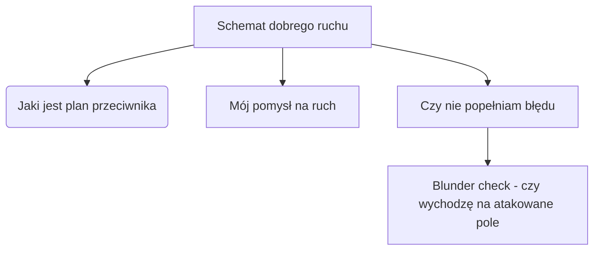

```mermaid
flowchart TD
    A[Schemat dobrego ruchu] --> B(Jaki jest plan przeciwnika)
    A --> C[Mój pomysł na ruch]
    A -->D[Czy nie popełniam błędu]
    D -->E[Blunder check - czy wychodzę na atakowane pole]
```
